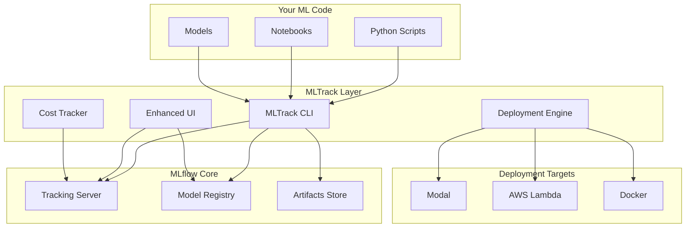

# Architecture

MLTrack is designed as a lightweight enhancement layer on top of MLflow. It doesn't replace or modify MLflow - instead, it adds the missing pieces that make ML deployment delightful.

## High-Level Overview



## Components

### MLTrack CLI
The command-line interface that makes ML workflows intuitive:

```bash
ml train script.py      # Enhanced training with automatic tracking
ml ui                   # Launch the beautiful dashboard
ml ship model --modal   # Deploy anywhere with one command
```

The CLI wraps MLflow's Python API with sensible defaults and enhanced functionality.

### Enhanced UI
A modern, responsive dashboard built with:
- **Next.js** for blazing-fast performance
- **Tailwind CSS** for beautiful, consistent styling
- **Real-time updates** for live experiment tracking
- **Advanced filtering** to find experiments quickly

### Deployment Engine
The deployment engine handles the complexity of productionizing models:

<Alert type="info">
The deployment engine automatically handles dependencies, containerization, and API creation - you just specify where to deploy.
</Alert>

1. **Dependency Resolution** - Automatically detects and packages requirements
2. **Container Building** - Creates optimized containers for your models
3. **API Generation** - Generates REST endpoints with proper error handling
4. **Multi-Cloud Support** - Deploy to any supported platform

### Cost Tracker
Track costs across your entire ML pipeline:

- **Training Costs** - GPU hours, compute time, data transfer
- **Storage Costs** - Model artifacts, datasets, logs
- **Deployment Costs** - API calls, hosting, bandwidth
- **Team Analytics** - Cost per user, project, or experiment

## How It Works

### 1. Training Enhancement
When you run `ml train`, MLTrack:
1. Wraps your script with MLflow tracking
2. Automatically logs parameters, metrics, and artifacts
3. Captures system metrics (GPU usage, memory, etc.)
4. Tracks costs based on compute usage

### 2. UI Integration
The MLTrack UI connects directly to your MLflow tracking server:
1. Reads experiments and runs via MLflow API
2. Enhances data with additional metadata
3. Provides real-time updates via WebSocket
4. Offers advanced filtering and visualization

### 3. Deployment Flow
When you run `ml ship model --modal`:
1. Retrieves model from MLflow registry
2. Analyzes dependencies and requirements
3. Builds optimized container image
4. Deploys to target platform
5. Returns endpoint URL and credentials

## Design Principles

### Zero Lock-in
MLTrack stores all data in MLflow-compatible formats. You can switch back to vanilla MLflow anytime without losing anything.

### Minimal Overhead
MLTrack adds < 1% overhead to training time and uses minimal additional storage.

### Security First
- No data leaves your infrastructure
- Supports all MLflow authentication methods
- Encrypted communication throughout

### Extensible
Easy to add new deployment targets, UI features, or tracking capabilities via plugins.

## File Structure

MLTrack follows MLflow's conventions while adding its own organization:

```
your-project/
├── mlruns/              # Standard MLflow tracking data
├── models/              # MLflow model registry
├── .mltrack/            # MLTrack-specific config
│   ├── config.yaml      # Project configuration
│   ├── deployments/     # Deployment metadata
│   └── costs/           # Cost tracking data
└── your-code/           # Your ML code
```

## Next Steps

- Learn about [Experiment Tracking](/docs/core-concepts/tracking) enhancements
- Explore [Deployment](/docs/core-concepts/deployment) options
- Understand [Cost Tracking](/docs/core-concepts/cost-tracking) capabilities